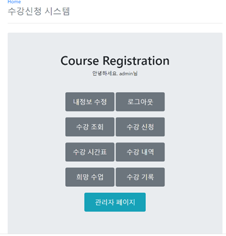

# README

# course-registration-system

Spring Boot 수강신청 웹 사이트 토이 프로젝트

### Main Page



## ERD

.png)

### How to Build

### 1. git clone 

```
https://github.com/shyswy/toyproject.git
```

### 2. Modify application-db.yml (db setting) 

```yaml
datasource: 
    driver-class-name: [Driver Name]
    url: [DB url]
    username: [username]
    password: [password]
```

### 3. Insert Initial Setting

```sql
SET SQL_SAFE_UPDATES = 0;
insert into MAJOR (MAJOR_NAME) values ( 'Computer Science' );
insert into MAJOR (MAJOR_NAME) values ( 'Mathmatics' );
insert into MAJOR (MAJOR_NAME) values ( 'law' );
insert into MAJOR (MAJOR_NAME) values ( 'chemical' );
insert into MAJOR (MAJOR_NAME) values ( 'physics' );
insert into MAJOR (MAJOR_NAME) values ( 'economics' );

insert into COURSE (COURSE_NAME, MAJOR_ID) VALUES ( 'Java Programming', 1);
insert into COURSE (COURSE_NAME, MAJOR_ID) VALUES ( 'database', 1);
insert into COURSE (COURSE_NAME, MAJOR_ID) VALUES ( 'math1',2 );
insert into COURSE (COURSE_NAME, MAJOR_ID) VALUES ( 'math2', 2);
insert into COURSE (COURSE_NAME, MAJOR_ID) VALUES ( 'law1', 3);
insert into COURSE (COURSE_NAME, MAJOR_ID) VALUES ( 'law2', 3);
insert into COURSE (COURSE_NAME, MAJOR_ID) VALUES ( 'chemical1', 4);
insert into COURSE (COURSE_NAME, MAJOR_ID) VALUES ( 'chmical2', 4);
insert into COURSE (COURSE_NAME, MAJOR_ID) VALUES ( 'physic1', 5);
insert into COURSE (COURSE_NAME, MAJOR_ID) VALUES ( 'physci2', 5);

insert into ROOM (MAX_PERSON,ROOM_NO,BUILDING_NAME) values ( 30 ,'508','ITBT' );
insert into ROOM (MAX_PERSON,ROOM_NO,BUILDING_NAME) values ( 10 ,100,'HIT' );

insert into CLASSES (CLASS_NUMBER, CUR_STUDENT_NUM, MAX_STUDENT_NUM, PROFESSOR_NAME, COURSE_ID,ROOM_ID,DAY,START_TIME,END_TIME,grade_amount) VALUES ( 1, 0, 2, 'KIM', 1,1,1,12,16,3 );
insert into CLASSES (CLASS_NUMBER, CUR_STUDENT_NUM, MAX_STUDENT_NUM, PROFESSOR_NAME, COURSE_ID,ROOM_ID,DAY,START_TIME,END_TIME,grade_amount) VALUES ( 2, 0, 2, 'LEE', 1,1,2,12,16,3 );
insert into CLASSES (CLASS_NUMBER, CUR_STUDENT_NUM, MAX_STUDENT_NUM, PROFESSOR_NAME, COURSE_ID,ROOM_ID,DAY,START_TIME,END_TIME,grade_amount) VALUES ( 3, 0, 2, 'KIM', 1,1,3,12,16 ,3);
insert into CLASSES (CLASS_NUMBER, CUR_STUDENT_NUM, MAX_STUDENT_NUM, PROFESSOR_NAME, COURSE_ID,ROOM_ID,DAY,START_TIME,END_TIME,grade_amount) VALUES ( 4, 0, 2, 'LEE', 1,1,4,12,16 ,3);
insert into CLASSES (CLASS_NUMBER, CUR_STUDENT_NUM, MAX_STUDENT_NUM, PROFESSOR_NAME, COURSE_ID,ROOM_ID,DAY,START_TIME,END_TIME,grade_amount) VALUES ( 5, 0, 2, 'shy1', 2,1,5,12,16 ,3);
insert into CLASSES (CLASS_NUMBER, CUR_STUDENT_NUM, MAX_STUDENT_NUM, PROFESSOR_NAME, COURSE_ID,ROOM_ID,DAY,START_TIME,END_TIME,grade_amount) VALUES ( 6, 0, 2, 'shy2', 2,1,6,12,16,3 );
insert into CLASSES (CLASS_NUMBER, CUR_STUDENT_NUM, MAX_STUDENT_NUM, PROFESSOR_NAME, COURSE_ID,ROOM_ID,DAY,START_TIME,END_TIME,grade_amount) VALUES ( 7, 0, 2, 'KIM2', 3,1,7,12,16 ,2);
insert into CLASSES (CLASS_NUMBER, CUR_STUDENT_NUM, MAX_STUDENT_NUM, PROFESSOR_NAME, COURSE_ID,ROOM_ID,DAY,START_TIME,END_TIME,grade_amount) VALUES ( 8, 0, 2, 'LEE2', 3,2,1,12,16,2 );
insert into CLASSES (CLASS_NUMBER, CUR_STUDENT_NUM, MAX_STUDENT_NUM, PROFESSOR_NAME, COURSE_ID,ROOM_ID,DAY,START_TIME,END_TIME,grade_amount) VALUES ( 9, 0, 2, 'KIM3', 4,2,2,10,13,2 );
insert into CLASSES (CLASS_NUMBER, CUR_STUDENT_NUM, MAX_STUDENT_NUM, PROFESSOR_NAME, COURSE_ID,ROOM_ID,DAY,START_TIME,END_TIME,grade_amount) VALUES ( 10, 0, 2, 'shy3', 4,2,3,12,16,2 );
insert into CLASSES (CLASS_NUMBER, CUR_STUDENT_NUM, MAX_STUDENT_NUM, PROFESSOR_NAME, COURSE_ID,ROOM_ID,DAY,START_TIME,END_TIME,grade_amount) VALUES ( 11, 0, 5, 'bad', 3,2,6,1,2,3 );
insert into CLASSES (CLASS_NUMBER, CUR_STUDENT_NUM, MAX_STUDENT_NUM, PROFESSOR_NAME, COURSE_ID,ROOM_ID,DAY,START_TIME,END_TIME,grade_amount) VALUES ( 12, 0, 5, 'good', 4,2,5,1,2,3 );
insert into CLASSES (CLASS_NUMBER, CUR_STUDENT_NUM, MAX_STUDENT_NUM, PROFESSOR_NAME, COURSE_ID,ROOM_ID,DAY,START_TIME,END_TIME,grade_amount) VALUES ( 11, 0, 5, 'g2', 5,2,4,4,6,2 );
insert into CLASSES (CLASS_NUMBER, CUR_STUDENT_NUM, MAX_STUDENT_NUM, PROFESSOR_NAME, COURSE_ID,ROOM_ID,DAY,START_TIME,END_TIME,grade_amount) VALUES ( 12, 0, 5, 'b2', 6,2,5,4,6,2 );
insert into CLASSES (CLASS_NUMBER, CUR_STUDENT_NUM, MAX_STUDENT_NUM, PROFESSOR_NAME, COURSE_ID,ROOM_ID,DAY,START_TIME,END_TIME,grade_amount) VALUES ( 11, 0, 5, 'g2', 7,2,4,6,8,2 );
insert into CLASSES (CLASS_NUMBER, CUR_STUDENT_NUM, MAX_STUDENT_NUM, PROFESSOR_NAME, COURSE_ID,ROOM_ID,DAY,START_TIME,END_TIME,grade_amount) VALUES ( 12, 0, 5, 'b2', 8,2,5,6,8,2 );
insert into CLASSES (CLASS_NUMBER, CUR_STUDENT_NUM, MAX_STUDENT_NUM, PROFESSOR_NAME, COURSE_ID,ROOM_ID,DAY,START_TIME,END_TIME,grade_amount) VALUES ( 11, 0, 5, 'g2', 9,2,4,9,10,2 );
insert into CLASSES (CLASS_NUMBER, CUR_STUDENT_NUM, MAX_STUDENT_NUM, PROFESSOR_NAME, COURSE_ID,ROOM_ID,DAY,START_TIME,END_TIME,grade_amount) VALUES ( 12, 0, 5, 'b2', 1,2,5,9,10,2 );
```

DB에 해당 SQL 파일을 통해 초기 Course, Room, Classes를 세팅해줍니다.  

### 4. Run Application


### 5. Set Admin

```sql
update user set aaaa=1 where user.user_id=1
```

해당 코드를 통해서 해당 유저의 역할을 ‘관리자’ 로 설정해줍니다. 관리자 관련 기능은 해당 유저로 로그인하여 사용 가능합니다.

---

### UI

**홈**


여러가지 기능을 모아 놓은 Home.html 입니다. 각 버튼을 누를 시, 해당 작업을 수행하는 Controller에 매핑 후, 필요하다면 정보를 처리해준 뒤, 다시 적절한 프론트 페이지(html)을 리턴 해줍니다. 
맨 아래 관리자 페이지의 경우, 관리자 유저만이 클릭하여 접근 가능합니다.

****


로그인 페이지의 경우, Home.html 의 login 버튼이나 Spring security 를 사용하여 이동할 수 있습니다. 전자의 경우 home 페이지의 login 버튼을 사용하면 됩니다.
후자의 경우, 만약 현재 로그인이 되어있지 않은 유저는 Spring Security에서 anonymous User로 분류되어 Home 화면, Login 화면,SignUp 화면을 제외한 화면에 대한 접근권한이 없습니다.
만약 해당 페이지들에 접근하려는 시도가 발생하면 자동으로 Login 화면으로 매핑되어 login 을 유도합니다. 
아이디와 비밀번호를 입력 후 로그인을 클릭시 html 에 tymeleaf의 form 에 채워진 정보들이 submit 되며 login을 처리하는 컨트롤러에 Mapping 됩니다. 
회원가입 버튼을 클릭 시 signup.html 페이지로 이동되며, 취소 버튼 클릭 시 다시 홈 화면으로 이동합니다.

**수강편람**


수강편람의 경우, 수업조회 버튼을 클릭 시 이동됩니다. 왼쪽의 박스에서 전공을 선택하면 해당 전공에 맞는 과목들이 나타납니다.
빈 창에 키워드를 검색하면, 해당 키워드가 포함된 과목만 나타나게 됩니다. 

그리고 내가 보고 싶은 과목의 수업 조회 버튼을 클릭 시, 아래 그림과 같이 해당 과목에서 개설된 모든 수업 정보들이 나타나게 됩니다.


여기서 시간과 요일, 학점에 대한 데이터에 대한 설명을 하고 넘어가겠습니다. 
세 정보 모두 Long 타입으로 정의하였고, ‘요일’ 의 경우 1L ~ 7L 이 월요일에서 일요일을 나타냅니다.
시간의 경우, 0~ 48 이 존재하고, 1= 30분 입니다. 즉 24 = 12시 이고, 25 = 12시 30분 입니다.
Grade도 이와 유사하게 0~8 이 존재하는데, 1= 0.5 학점입니다.  즉 F =0, B0 = 5 , A+ = 8 로 표현됩니다. 이는 float 등의 소수점을 포함한 type 들이 가지는 부동소수점 문제를 염두하여 설계한 것 입니다.

**수강신청**


Home 페이지에서 수강신청 버튼을 클릭 시 Mapping 됩니다.  희망 추가 버튼을 클릭 시 해당 수업을 희망 수업 리스트에 추가합니다. 
신청 버튼을 클릭 시 해당 수업을 신청합니다. 
만약 이미 신청한 내역들 중 이번 학기에 수강하는, 즉 아직 성적이 기입 안된 수업들 중 이미 해당 수업과 똑 같은 과목을 수강했거나, 겹치는 시간대에 수업을 신청하였다면 
에러 메시지와 함께 수강신청이 되지 않습니다.

**희망수업**


희망추가 버튼을 클릭 시 해당 수업이 이곳에 담깁니다. 수강 신청 버튼 클릭 시 수강신청 란에서 수강신청 버튼을 클릭한 것 과 똑 같은 방식으로 수강 신청을 시도하고
희망 삭제 버튼을 클릭 시 해당 수업을 희망 수업 목록에서 지웁니다.

**수강기록**


수강했던 수업들 중, 학점이 기입된, 즉 이수가 완료된 과목들입니다. 
만약 수강한 과목의 학점이 B0 (5) 보다 낮다면 수강 취소(학점 포기) 가 가능하고, 이후 다시 수강신청 할 수 있게 됩니다. 
하지만 B0 이상이라면, 수강 취소 버튼 대신 done 이라는 문구가 나타나며, 학점을 포기할 수 없고, 이에 따라 재수강 역시 불가능 하게 됩니다.

**수강 시간표**


Home 화면에서 수강 시간표 버튼을 클릭 시, 요일을 선택할 수 있는 페이지로 이동합니다.

해당 요일을 클릭 시, 해당 요일에 들어야 하는 수업들이 시간 순으로 표기 됩니다.

시간표 화면은 아래와 같습니다.


‘수강 시간표’ 는 현재 듣고 있는 수업 기준으로 만들어지기에, 학점이 기입된 과목들은 모두 제외 되고, 아직 학점이 기입되지 않은 과목들만 나타납니다.

**관리자 홈**


위 사진은 관리자가 홈 화면에서 관리자 페이지 버튼을 클릭 시 이동하는 화면입니다.

과목 추가 버튼은 새로운 강의를 신설할 때 사용되고, 과목 삭제 및 수정은 수업 정보( 수강인원)

을 변경하거나 해당 수업을 폐강할 때 사용합니다. 학생 정보는 모든 학생들의 정보를 조회하고, 해당 학생이 수강완료한 수업의 점수를 기입하는 데에 사용됩니다. 
여기서 수업 점수를 기입하면, 해당과목은 이수완료 된 것으로 처리되게 됩니다.  
그리고 통계 는 OLAP 으로써 통계자료를 보여줍니다.

**수업추가**


수업을 추가하는 곳입니다. Db 안에 들어있는 과목, 교실들 중 하나를 select 한 뒤 수업 정보를 기입하여 수업 추가 버튼을 클릭 시 새로운 수업이 생성됩니다.

**폐강 및 수업 정보 수정**


관리자 페이지에서 수업 정보 수정, 폐강 버튼을 클릭 시 이동합니다. 폐강 버튼 클릭 시 해당 수업이 데이터 베이스에서 사라지고, 정원 변경 시 새로운 정원을 입력하는 페이지로 redirect 되며, 거기서 입력한 정원대로 해당 수업의 최대 인원이 수정됩니다.

**학생정보 조회 및 성적 기입**


학생 정보 버튼을 클릭 시 해당 학생의 정보가 나타나고, 수업조회 버튼을 클릭 시 해당 학생이 들었던 수업들이 나타납니다.


여기서 점수 변경을 클릭 시 해당 학생의 점수 정보를 변경하고, 이는 곧 점수 기입을 의미하기도 하여 만약 점수가 99(디폴트 값)에서 이외의 값으로 변경되었다면 해당 과목이 이수 완료된 것으로 처리됩니다.

**통계화면(OLAP)**


편차는 과목 평균 – 해당 과목을 수강한 학생들의 평균 학점의 평균 의 값으로, 그 값이 높을수록 학점을 짜게 주는 수업이 되고, 해당 페이지에선 상대적으로 적게 주는 10개의 수업을 순서대로 보여줍니다. 
